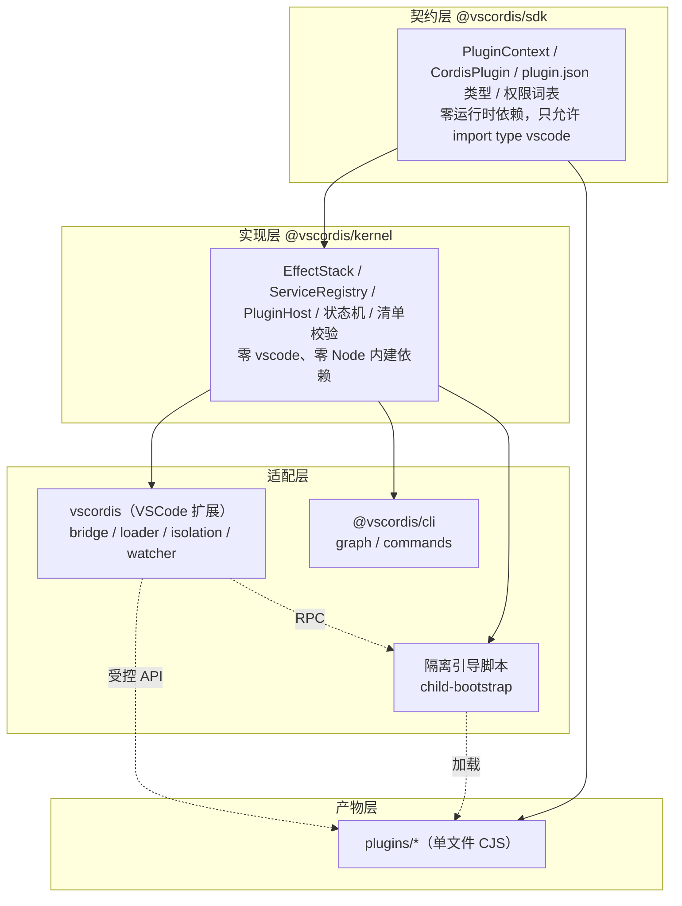

# vscordis 架构总览

> 面向要在本仓库改代码的人。决策的**理由**在 `docs/adr/*.md`，这里讲**结构与不变式**。

## 1. 要解决的问题

VSCode 原生扩展系统的四个硬约束（都有源码级证据，见 ADR-0002 / 0003）：

1. 所有扩展共享同一个 Extension Host 进程；
2. 扩展 `activate()` 之后，**没有公开 API** 能在运行期单独卸载它注册的命令 / 监听器；
3. `deactivate()` 只在扩展宿主退出时被调用，不是"活体摘除"；
4. `extensionDependencies` 只是扩展 ID 声明，没有类型化服务契约，也没有依赖变化时的协调。

vscordis 的答案是：**不试图卸载扩展，而是把"业务功能"做成扩展内部的插件**，
由一个微型运行时管理它们的生命周期。这个运行时向 Cordis 借两个概念：

| 概念 | 含义 | 本仓库的落点 |
| --- | --- | --- |
| 时间可组合性 | 每个副作用都有逆操作，卸载时逆序回收 | `EffectStack`（严格 LIFO 串行） |
| 空间可组合性 | 依赖由声明式契约表达，提供者变化时运行时自动协调 | `ServiceRegistry` + `PluginHost` 状态机 |

## 2. 分层：为什么 kernel 里一行 `vscode` 都没有



kernel 零 `vscode` 依赖换来了三件事，每一件都在实际开发中救了命：

1. **生命周期可以被完整单测**。`FakeHostPort` 一替，`PluginHost` 的全部状态转换（含级联暂停/恢复、
   activate 回滚、依赖等待）都能用 `node --test` 跑，不需要启动 VSCode。
2. **kernel 可以在子进程里跑**。隔离引导脚本用的是**同一套** `EffectStack` ——
   插件的副作用回收语义在两种模式下完全一致，不是"隔离模式另有一套"。
3. **可以在 Web Worker 里跑**（ADR-0006），Web 宿主因此复用同一套状态机。

代价：跨层通信需要显式类型（`HostPort` / `IsolatedHostApi`），多了一层间接。
`scripts/build.mjs` 里 Web 入口用 `platform: 'browser'` 构建 —— 一旦 kernel 误引 Node 内建模块，
**构建立刻失败**。这条纪律因此是可机器验证的，不靠自觉。

## 3. 核心抽象与它们的不变式

### 3.1 `EffectStack`（时间可组合性）

| 编号 | 不变式 | 守护它的测试 |
| --- | --- | --- |
| I1 | 注册即入栈：`open` 状态下登记的资源最终必被回收 | `effect-stack.spec.ts` |
| I2 | **严格 LIFO + 串行 `await`**（与 cordis fiber 顶层的 `Promise.all` 并发是有意分歧） | 同上 |
| I3 | 失败隔离：单个 teardown 抛错/超时（默认 5s）不阻断其余回收 | 同上 |
| I4 | **闭栈后登记立即回收**：卸载与注册竞态不留逃逸资源 | 同上 |

两条容易被忽略的约束：

- `effect(register, dispose)` 的 `register` **必须是同步函数**。若允许异步，"拿到句柄"与
  "登记逆操作"之间就存在 await 窗口，该窗口内发起卸载会导致资源逃逸。需要异步建资源请用 `effectAsync`。
- teardown 必须**幂等安全**：插件可以自己提前 `dispose()`，栈稍后仍会再调用一次。
  桥接层对 VSCode 返回的 Disposable 统一加幂等掩码。

### 3.2 `ServiceRegistry`（空间可组合性）

- 键是**服务名**而不是插件 id —— 提供者可以换人，消费者一行都不用改（ADR-0007 决策 1）。
- `provide()` 返回 `Disposable`，并且通常会被登记到提供者的 EffectStack 上。
  **这就是级联的全部实现**：提供者卸载 → 栈回收 `provide` → 触发 revoke →
  宿主把受影响的消费者排到队列尾部暂停。A→B→C 的传递闭包**没有一行特判代码**。
- 冲突默认 `exclusive`（第二个提供者抛 `ServiceConflictError`），可显式 `last-wins`。
- `revoke()` 会清理"无提供者且无消费者"的空槽位 —— 否则反复启停会让注册表持续膨胀。

### 3.3 `PluginHost`（状态机）

```
idle ──load──► loading ──► active ⇄ paused
                  │          ▲        │
                  │          └────────┘ 依赖恢复
                  └──► failed（回滚完成，不自动重试）
```

- `paused` 有两种成因，语义相同：首次加载时依赖未满足；曾经 active 而硬依赖被撤销。
- **所有生命周期操作共用一条串行队列**。这带来可预期的顺序（有 9 项竞态测试守着），
  代价是**任何单个任务都必须有界** —— 所以 `activate()` 有超时（ADR-0015）。
- 依赖变化事件被投递到**队列尾部**再处理，保证"提供者彻底卸载完毕 → 消费者才开始暂停"。

## 4. 两种执行模式

| | in-process（`trust: trusted`） | 隔离子进程（`trust: untrusted`） |
| --- | --- | --- |
| 模块来源 | `require()` 单文件 CJS，卸载时清空插件目录下整棵 `require.cache` | `child_process.fork` + 引导脚本 |
| 边界强度 | **只防误用**：宿主会把 `vscode` 注入给扩展目录下任何模块 | **真边界**：子进程里没有 `vscode`，fs 受 Node 权限模型限制 |
| 副作用回收 | `EffectStack` LIFO（尽力而为：清缓存不强制回收可达闭包） | 同一套 `EffectStack` + 进程退出兜底 |
| `vscode` API | 受控代理（权限在**调用时刻**校验） | RPC 代理，命令 handler 走**反向调用** |
| `ctx.async`（显式异步面） | ✅ 同一份签名 | ✅ 同一份签名（ADR-0018） |
| 服务（`provide`/`use`） | ✅ 活对象 | `provide` ✅（注册为 `remote: true` 的异步代理）；`use` 需走 `ctx.async.useService`（ADR-0019） |
| 服务 | ✅ | ❌ 明确抛错（服务是进程内对象，跨进程需 IDL） |
| 无后端时 | — | **拒绝加载**（fail-closed，绝不降级到同进程） |

路由发生在 `Runtime` 的组合 loader 里：`bridge.ts` 一行都不需要知道隔离的存在。

## 5. 一次生命周期里发生了什么

**加载**：发现（`discovery.ts`，校验清单 + 路径安全）→ 完整性/签名校验（`integrity.ts`，
**在 require 之前**）→ 依赖预检（缺则 parked，连模块都不加载）→ 加载模块 →
合并 `plugin.inject` 再判一次依赖 → 建 `EffectStack` + `PluginContext` → `activate()`（有超时）
→ 比对 `provides` 声明与实际（不一致则告警）。

**卸载**：`deactivate(ctx)`（此时服务与命令仍存活，便于体面收尾）→ `EffectStack.dispose()`
（LIFO → 触发 `provide` 的 revoke → 级联）→ 释放模块缓存 / kill 子进程。

**提供者消失**：revoke 事件 → 队列尾部任务 → 受影响消费者 `pause`（完整卸载但保留记录）→
在同一个任务里尝试唤醒所有依赖已就绪的 `paused` 插件。

**文件变化**：`PluginWatcher`（`fs.watch` 递归 + 防抖）→ 纯函数 `planReload` 映射成"重载谁 +
是否重扫" → 重扫（清单可能改了 id/依赖）→ 逐个 reload。编译由 `npm run watch` 负责，
**刻意不把 esbuild 塞进宿主进程**（ADR-0011）。

## 6. "一份实现，多个调用方"

这是本仓库最重要的组织原则，改代码前先看清：

| 实现 | 谁在用 |
| --- | --- |
| `kernel/manifest.ts` 的 `validateManifest` | 宿主发现插件、CLI 的 list/tree |
| `host/discovery.ts` | 宿主启动、CLI（**相对导入**，见 ADR-0014 决策 3） |
| `host/integrity.ts` | 宿主加载器、`scripts/sign-plugin.mjs`、CLI 的 `sign`、以及测试 |
| `kernel/effect-stack.ts` | in-process 插件、隔离子进程里的插件 |
| `kernel/graph.ts`（在 cli 包） | CLI 的 tree/list；纯函数无 IO |

## 7. 贡献者地图：想改 X 就去 Y

| 想做的事 | 去处 | 注意 |
| --- | --- | --- |
| 加一个受控 VSCode API | `sdk/vscode-api.ts`（类型）+ `host/bridge.ts`（代理 + 权限） | 两处都要改；权限词表在 `sdk/permission.ts`，**内核有一份副本**，靠 parity 测试防漂移 |
| 加一个权限 | `sdk/permission.ts` + `kernel/permissions.ts` | 跑 `permission-parity.spec.ts` |
| 改依赖协调语义 | `kernel/plugin-host.ts` | ADR-0007 的四条决策都要一起看；改完必须跑 `races.spec.ts` 与 `soak.spec.ts` |
| 加隔离模式能力 | `isolation/{protocol,child-bootstrap,isolated-loader,vscode-host-api}.ts` | 四处都要动；`ISOLATION_UNSUPPORTED` 里的说明要同步 |
| 改热重载判定 | `host/watcher.ts` 的 `planReload` | 它是纯函数，先加测试 |
| 加 CI 检查 | `.github/workflows/ci.yml` | |

## 8. 必须守住的三个不变式（破了就是设计事故）

1. **kernel 不 import `vscode`、不 import Node 内建模块**。破了 Web 构建会失败（护栏已在），
   但更容易犯的是"在 host 里写一个 kernel 该有的逻辑" —— 那会让它无法被单测。
2. **`trust: untrusted` 在没有隔离后端时必须是拒绝，而不是降级**。任何"没后端就同进程跑吧"
   的写法都是事故。
3. **`paused` 不等于"可以继续用旧服务"**。消费者暂停时会**完整卸载**并在恢复时**重新
   `activate`**（拿到新实例）；任何"保留旧引用只在旁边标记一下"的优化都会引入过期对象。

## 9. 阅读路径

1. `README.md` —— 能做什么、硬限制是什么；
2. 本文 —— 结构；
3. `packages/sdk/src/context.ts` —— 插件看到的全部世界（注释里写了每个动词的取舍）；
4. `packages/kernel/src/effect-stack.ts` + `service-registry.ts` + `plugin-host.ts` —— 三个核心；
5. `docs/adr/0002`、`0003`、`0007`、`0015` —— 最容易踩坑的四个决策；
6. `docs/plugin-authoring.md` —— 写插件的人该看什么。
